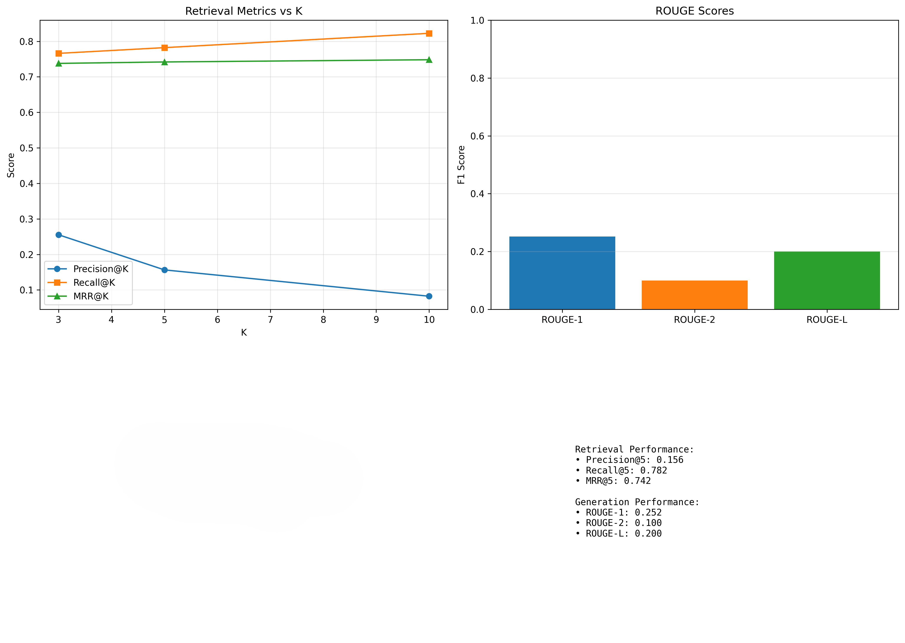
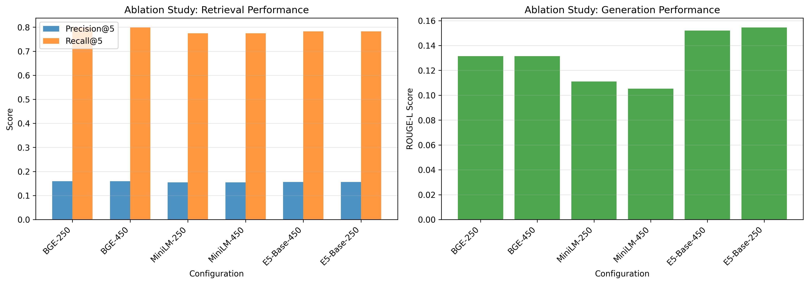

# **RAG System for Querying Fairness & Bias Research in LLMs**

A domain-specialized Retrieval-Augmented Generation (RAG) system designed to answer technical questions about *fairness and bias in Large Language Models (LLMs)*.
The system indexes 20+ research papers, retrieves relevant context, and generates grounded, citation-backed answers using FLAN-T5-XL.

This repository contains the full pipeline:

➡️ **PDF processing → chunking → embedding → FAISS retrieval → FLAN-T5 generation → evaluation → UI**

---

## **🚀 Features**

* **Sentence-level chunking** using spaCy transformers
* **Three embedding models** supported: MiniLM, BGE-small, E5-base
* **FAISS vector search** with inner-product similarity
* **Context-aware generation** using FLAN-T5-XL
* **Caching** for repeated queries
* **Human & automatic evaluation framework** (Precision@K, Recall@K, MRR, ROUGE)
* **Gradio UI** for interactive querying
* **124 custom annotated Q/A pairs** for evaluation

---

## **📁 Repository Structure**

```
rag-llm-bias-research/
│
├── src/
│   ├── prepare_data.py        # PDF extraction, sentence chunking, filtering
│   ├── retrieval.py           # E5-based retrieval, caching, FAISS search
│   ├── generation.py          # FLAN-T5-XL answer generation
│   ├── evaluation.py          # Precision@K, Recall@K, MRR, ROUGE, human eval
│   ├── ui.py                  # Gradio interface
│   ├── config.py              # All system-wide configuration flags
│   └── main.py                # Entry point for running modules
│
├── papers_pdf/                # 20+ research papers (PDF)
│
├── data/
│   ├── chunks.jsonl           # 2,847 processed chunks
│   ├── metas.jsonl            # Chunk metadata
│   ├── embeddings.npy         # Embeddings matrix
│   ├── version.json           # Index versioning info
│
│
├── index/
│   └── faiss_index.idx        # FAISS vector index
│
├── evaluation/
│   ├── evaluation_results.json
│   ├── ablation_study.json
│   ├── error_analysis.json
│   ├── ablation_comparison.png
│   ├── evaluation_results.png
│   └── human_eval.csv
│
├── qa_pairs.json          # 124 annotated Q/A pairs
│
├── requirements.txt
└── README.md
```

---

## **🛠 Installation**

### **1. Clone the repository**

```bash
git clone https://github.com/NorthChat/NLP_Final_Project.git
cd NLP_Final_Project
```

### **2. Install dependencies**

```bash
pip install torch torchvision --index-url https://download.pytorch.org/whl/cu126
pip install -r requirements.txt
```

### **3. (Optional) Download spaCy model**

```bash
python -m spacy download en_core_web_trf
```

---

## **📚 Preparing the Dataset**

### **Extract PDFs, chunk text, create embeddings & build index**

This runs the entire preprocessing pipeline:

```bash
python src/main.py --prepare --model e5-base
```

This will:

* Extract clean text from PDFs
* Create 5-sentence overlapping chunks
* Filter low-quality chunks (tables, captions, citations)
* Generate embeddings
* Build FAISS index

You can also run ablation settings:

```bash
python src/main.py --prepare --ablation
```

---

## **🔍 Running Retrieval + Generation**

### **Command-line RAG run**

```bash
python src/main.py --query "How does Auto-Debias detect biased prompts?"
```

Outputs:

* Retrieved chunks
* Model-generated answer
* Paper IDs used

---

## **🧪 Evaluation**

### **Automatic evaluation (Precision@K, Recall@K, MRR, ROUGE):**

```bash
python src/main.py --evaluate
```



### **Human evaluation workflow:**

Human eval covers:

* Correctness (1–5)
* Groundedness (1–5)
* Completeness (1–5)

---

## **🌐 Launch the Interactive UI**

```bash
python src/main.py --ui
```

The interface supports:

* Live questioning
* Adjustable Top-K retrieval
* Retrieved context display
* Answer grounding transparency

Runs locally at:

```
http://localhost:7860
```

---

## **🧪 Ablation Study**

The project includes experiments comparing:

| Model         | Dim | Retrieval P@5 | ROUGE-L   |
| ------------- | --- | ------------- | --------- |
| **BGE-small** | 384 | **0.160**     | 0.131     |
| **E5-base**   | 768 | 0.156         | **0.154** |
| MiniLM-L6     | 384 | 0.155         | 0.111     |



Run study:

```bash
python src/main.py --prepare --ablation
```

---

## **📊 Dataset Details**

### **Papers indexed:** 20+

### **Chunks created:** 2,847 (sentence-level, filtered)

### **Evaluation Q/A pairs:** 124

---

## **🧠 System Architecture**

```
               ┌───────────────────────┐
               │      PDF Corpus       │
               └──────────┬────────────┘
                          │
            extract + clean text (PyMuPDF)
                          │
               sentence segmentation (spaCy)
                          │
           chunk filtering + deduplication
                          │
                  embeddings (E5/BGE/MiniLM)
                          │
               ┌─────────────────────────┐
               │    FAISS Vector Index   │
               └──────────┬──────────────┘
                          │ retrieve top-K
                          ▼
                context selection & packing
                          │
                 generate answer using
                    FLAN-T5-XL
                          ▼
                  grounded final answer
```

---

## **📌 Configuration**

All config variables are defined in **`src/config.py`**:

* `CHUNK_SIZE`
* `CHUNK_OVERLAP`
* `TOP_K`
* `EMBEDDING_MODEL`
* `USE_CACHING`
* `MAX_NEW_TOKENS`
* `RETRIEVAL_MODEL`

Edit these to change behavior.

---

## **👩‍💻 Contributors**

### **Harini Hari**

* Data preparation pipeline
* Human evaluation framework
* Error analysis & visualizations
* Gradio UI
* 62 Q/A annotations

### **Preeta Chatterjee**

* Retrieval module (E5 support, caching, expansion)
* Generation module (FLAN-T5-XL, prompting)
* Metrics framework (P@K, R@K, MRR, ROUGE)
* Chunk filtering & index versioning
* Ablation experiments
* 62 Q/A annotations

---

## **📝 Citation**

If you use or reference this work:

```
Hari, H., & Chatterjee, P. (2025). 
Retrieval-Augmented Generation for Summarizing and Querying Research 
on Fairness and Bias in LLMs.
```

---

## **📬 Contact**

For any questions or issues:
**Preeta Chatterjee & Harini Hari**

